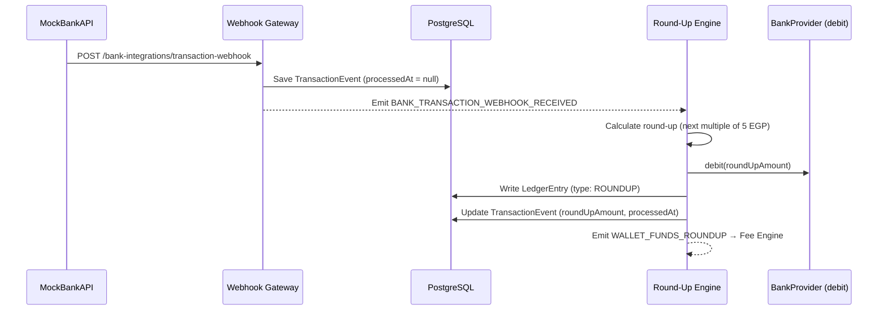

# Round-Up Engine

## Overview

The Round-Up Engine is the first processing stage in Tantaropic's **Golden Path** pipeline. When a user makes a purchase, the engine automatically calculates a round-up amount and collects it from their bank for investment.

**Position in Pipeline:**
```
Webhook Gateway → Round-Up Engine → Fee Engine → Asset Allocator
```

The engine is **fully isolated** — it communicates only through events, interfaces, and repositories. Removing it from the system has zero impact on other modules.

---

## Flow



### Step-by-Step

| Step | Component | Action |
|------|-----------|--------|
| 1 | Webhook Gateway | Receives raw transaction from MockBankAPI |
| 2 | Webhook Gateway | Idempotency check (by `transactionId`) |
| 3 | Webhook Gateway | Saves `TransactionEvent` row (processedAt = null) |
| 4 | Webhook Gateway | Emits `BANK_TRANSACTION_WEBHOOK_RECEIVED` event |
| 5 | Round-Up Engine | Listens to event via `@OnEvent` |
| 6 | Round-Up Engine | Calculates round-up amount |
| 7 | Round-Up Engine | Calls `IBankProvider.debit()` to collect funds |
| 8 | Round-Up Engine | Writes `LedgerEntry` with type `ROUNDUP` |
| 9 | Round-Up Engine | Marks `TransactionEvent.processedAt` + stores `roundUpAmount` |
| 10 | Round-Up Engine | Emits `WALLET_FUNDS_ROUNDUP` event for Fee Engine |

**Key Design Decision:** The Webhook Gateway contains **zero business logic**. It only persists and emits. All calculation, fund collection, and ledger operations happen in the Round-Up Engine.

---

## Round-Up Logic

### Rule
Round up to the **next multiple of 5 EGP**. If the amount is already an exact multiple of 5, add a **full 5 EGP**.

### Formula (BigInt)
```
ROUND_UP_STEP = 5
stepInSmallest = ROUND_UP_STEP × multiplier   // 500 piasters for EGP
remainder = amount % stepInSmallest
roundUp = (remainder === 0) ? stepInSmallest : (stepInSmallest - remainder)
```

### Examples

| Purchase (EGP) | Amount (piasters) | Next Multiple | Round-Up (EGP) | Round-Up (piasters) |
|----------------|-------------------|---------------|----------------|---------------------|
| 10.30 | 1030 | 15.00 | 4.70 | 470 |
| 6.50 | 650 | 10.00 | 3.50 | 350 |
| 2.00 | 200 | 5.00 | 3.00 | 300 |
| 14.10 | 1410 | 15.00 | 0.90 | 90 |
| 15.00 | 1500 | 20.00 | 5.00 | 500 |
| 20.00 | 2000 | 25.00 | 5.00 | 500 |

**Note:** The round-up amount is always > 0. There is no "skip" case.

---

## Events

### Input Event

| Property | Value |
|----------|-------|
| **Event Name** | `BANK_TRANSACTION_WEBHOOK_RECEIVED` |
| **Enum** | `SystemEventType.BANK_TRANSACTION_WEBHOOK_RECEIVED` |
| **String Value** | `bank.transaction_webhook_received` |
| **Emitted By** | `BankIntegrationService` |

**Payload: `TransactionWebhookReceivedEventPayload`**

```typescript
{
  timestamp?: Date;
  userId: string;                   // Required — who made the purchase
  transactionId: string;            // Unique bank transaction ID
  transactionEventId: string;       // DB row ID of the saved TransactionEvent
  money: Money;                     // Purchase amount as Money VO
  merchantTag?: MerchantTag;        // e.g., "GROCERIES", "CIGARETTES"
  idempotencyKey?: string;
  occurredAt: Date;                 // When the purchase happened
}
```

### Output Event

| Property | Value |
|----------|-------|
| **Event Name** | `WALLET_FUNDS_ROUNDUP` |
| **Enum** | `SystemEventType.WALLET_FUNDS_ROUNDUP` |
| **String Value** | `wallet.funds_roundup` |
| **Emitted By** | `RoundUpEngineService` |

**Payload: `RoundUpCompletedEventPayload`**

```typescript
{
  timestamp?: Date;
  userId: string;
  transactionId: string;             // Original bank transaction ID
  transactionEventId: string;        // DB row ID
  grossRoundUpAmount: Money;         // The amount collected (Money VO)
  merchantTag?: MerchantTag;         // Passed through for AI Engine
  idempotencyKey: string;            // Prefixed: "roundup-{originalKey}"
}
```

---

## Ledger Behavior

Each successful round-up creates exactly **one** `LedgerEntry`:

| Field | Value |
|-------|-------|
| `type` | `LedgerEntryType.ROUNDUP` |
| `amount` | The round-up amount (BigInt, piasters) |
| `currency` | `EGP` |
| `userId` | The user who made the purchase |
| `transactionEventId` | FK to the original `TransactionEvent` |
| `idempotencyKey` | `ledger-roundup-{originalIdempotencyKey}` |
| `note` | `Round-up from {merchantTag} transaction` |

**Accounting classification:** `ROUNDUP` is treated as a **credit** entry in balance calculations (money flowing into the wallet).

---

## Dependencies

| Dependency | Type | Purpose |
|------------|------|---------|
| `IBankProvider` (via `I_BANK_PROVIDER` token) | Interface | Calls `debit()` to collect round-up from user's bank |
| `TransactionEventRepository` (via `TransactionModule`) | Repository | Reads events, marks as processed |
| `LedgerRepository` | Repository | Writes `ROUNDUP` ledger entries |
| `EventEmitter2` | Global service | Emits `WALLET_FUNDS_ROUNDUP` |

### Module Import Graph

```
RoundUpEngineModule
  ├── imports: BankIntegrationModule  → provides IBankProvider
  └── imports: TransactionModule      → provides TransactionEventRepository
```

---

## Idempotency

| Layer | Mechanism |
|-------|-----------|
| Webhook Gateway | `transactionId` is `@unique` in schema. Duplicate webhooks are silently ignored. |
| Bank Debit | Debit uses `roundup-{idempotencyKey}` to prevent duplicate collections. |
| Ledger Entry | Ledger uses `ledger-roundup-{idempotencyKey}` to prevent duplicate entries. |

---

## Notes for Frontend

### What users should expect

- Every purchase triggers an automatic round-up to the next multiple of **5 EGP**
- Even exact amounts (e.g., 15.00 EGP) still get a 5.00 EGP round-up
- The collected amount appears in their wallet as invested funds

### Example user scenarios

| Scenario | Purchase | Round-Up | User sees |
|----------|----------|----------|-----------|
| Coffee | 12.50 EGP | 2.50 EGP | "2.50 EGP invested from coffee purchase" |
| Groceries | 47.30 EGP | 2.70 EGP | "2.70 EGP invested from grocery purchase" |
| Exact bill | 100.00 EGP | 5.00 EGP | "5.00 EGP invested from purchase" |

---

## Notes for Backend (Fee Engine)

### Event to listen to

```typescript
@OnEvent(SystemEventType.WALLET_FUNDS_ROUNDUP)
async handleRoundUp(payload: RoundUpCompletedEventPayload): Promise<void> {
  // payload.grossRoundUpAmount is a Money VO — the pre-fee amount
  // Apply FUND_FEE_BPS (50 BPS = 0.5%) to this amount
}
```

### Available data

| Field | Type | Description |
|-------|------|-------------|
| `grossRoundUpAmount` | `Money` | The full collected amount (before fees) |
| `userId` | `string` | User to charge the fee to |
| `transactionEventId` | `string` | Reference for ledger entries |
| `merchantTag` | `MerchantTag?` | For analytics / AI Engine |
| `idempotencyKey` | `string` | Derive fee idempotency from this |

### Safe assumptions

- `grossRoundUpAmount` is always > 0 (never zero)
- The funds have already been successfully collected from the bank
- A `LedgerEntry` of type `ROUNDUP` already exists for this amount
- The `TransactionEvent` is already marked as processed
- The Fee Engine should write its own `LedgerEntry` of type `FUND_FEE`

---

## File Structure

```
src/modules/roundup-engine/
├── roundup-engine.module.ts       # Module declaration
├── roundup-engine.service.ts      # Event listener + orchestrator
└── roundup.calculator.ts          # Pure round-up math function

src/modules/transaction/
├── transaction.module.ts          # TransactionEvent module
└── transaction-event.repository.ts # Persistence + idempotency
```
